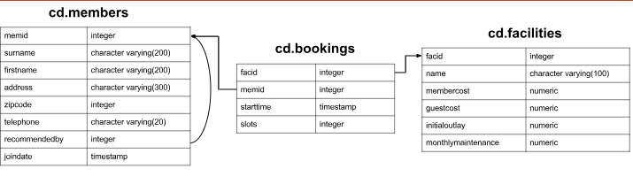

# Produce a list of costly bookings, using a subquery

The Produce a list of costly bookings exercise contained some messy logic: we had to calculate the booking cost in both the WHERE clause and the CASE statement. Try to simplify this calculation using subqueries. For reference, the question was:

_How can you produce a list of bookings on the day of 2012-09-14 which will cost the member (or guest) more than $30? Remember that guests have different costs to members (the listed costs are per half-hour 'slot'), and the guest user is always ID 0. Include in your output the name of the facility, the name of the member formatted as a single column, and the cost. Order by descending cost._



```sql
SELECT

```

## Steps

1. Identify Bookings on the Specific Date

We need to filter bookings from cd.bookings where the starttime is on 2012-09-14.

```sql
SELECT mem.id
FROM cd.bookings
WHERE date(cd.bookings.starttime) = '2012-09-14'

```

2. Calculate the Cost.

We need to determine the total cost of each booking, which differs for members and guests. We’ll handle this using a CASE expression:

- Members: Multiply the slots by the membercost of the facility.
- Guests: Multiply the slots by the guestcost.

3. Filter by Cost

Only include bookings where the calculated cost exceeds $30.

4. Output the Required Fields

Facility name (cd.facilities.name).
Full name of the member (cd.members.firstname and cd.members.surname combined).
Total cost of the booking.

5. Sort by Cost:

Order the results by total cost in descending order.
