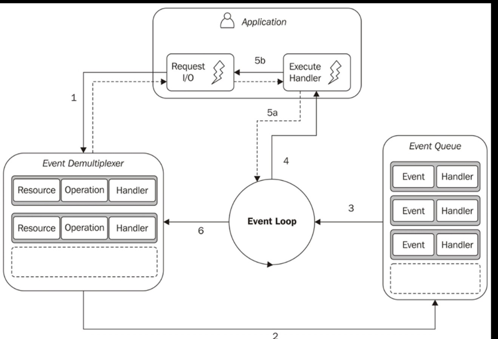

# Reactor Pattern

## What Is the Reactor Pattern?

The Reactor Pattern is all about how Node.js efficiently handles many I/O operations (like reading from a file or receiving data over a network) without blocking the main thread. It ensures that your app can process multiple tasks (like handling many users on a server) without waiting for one operation to finish before starting another.

Think of it like a restaurant where there’s one waiter serving many tables at the same time, without the waiter ever stopping and waiting too long at any one table.



1. **Submitting a Request to the Event Demultiplexer**

Your application makes a request, such as reading a file or getting data from a network connection. This is done by asking the Event Demultiplexer to watch over the I/O operation.

The application also provides a handler (in Node.js, this is a callback function), which will run when the operation completes. This part is non-blocking, meaning the application doesn't stop here and continues doing other things.

_Example in Node.js:_

```js
fs.readFile("file.txt", (err, data) => {
  // This is the handler (callback) function
  console.log("File data:", data);
});
```

2. **Waiting for I/O to Complete**

The Event Demultiplexer watches over the resources (file, network socket, etc.) that were requested. It waits until one of the operations is done.
At this point, the application is doing other things and isn't stuck waiting.

3. **Events Added to the Event Queue**

Once the I/O operation finishes (like the file is read or the network data is received), the Event Demultiplexer adds the event to the Event Queue.

The Event Queue is where all the tasks that need to be handled next are stored.

4. **The Event Loop Begins**

Now the Event Loop kicks in. The Event Loop is a continuously running loop in Node.js that checks if there are events waiting to be processed in the Event Queue.

If there are events in the queue, the Event Loop will take each event one by one and process it.

5. **Processing the Event Handler**

For each event in the queue, the associated handler (the callback function you provided earlier) is executed.

While the handler is running, it can also request new asynchronous operations. For example, inside the file read handler, you could make another network request.
Example:

```js
fs.readFile("file.txt", (err, data) => {
  // Handler for file read
  console.log("File data:", data);

  // While processing, you can trigger another async request
  fs.readFile("anotherFile.txt", (err, data) => {
    console.log("Another file data:", data);
  });
});
```

6. **Back to the Event Demultiplexer**

When all the events in the Event Queue have been processed, the Event Loop pauses (blocks) and waits for the Event Demultiplexer to notify it of any new events.

## Mental Model

Let's try to go over all this again, this time using a visual model correlated with a real life example.

The **Reactor Pattern** is a way to handle many tasks (like reading files, handling web requests, etc.) efficiently using a single thread. Think of it like a restaurant where there’s one waiter serving many tables at the same time, without the waiter ever stopping and waiting too long at any one table.

### System as Restaurant

- **Application (You)**: You’re the person running the restaurant, taking care of customers.
- **I/O Operation**: This is a customer asking for something, like food or drink.
- **Event Demultiplexer**: This is like the kitchen staff who are preparing the meals for each customer.
- **Event Queue**: This is a list of things (events) that are ready to be served, like when a dish is ready to be taken out to a customer.
- **Event Loop**: This is the waiter who takes dishes from the kitchen (Event Queue) and delivers them to the customers (callback functions).
