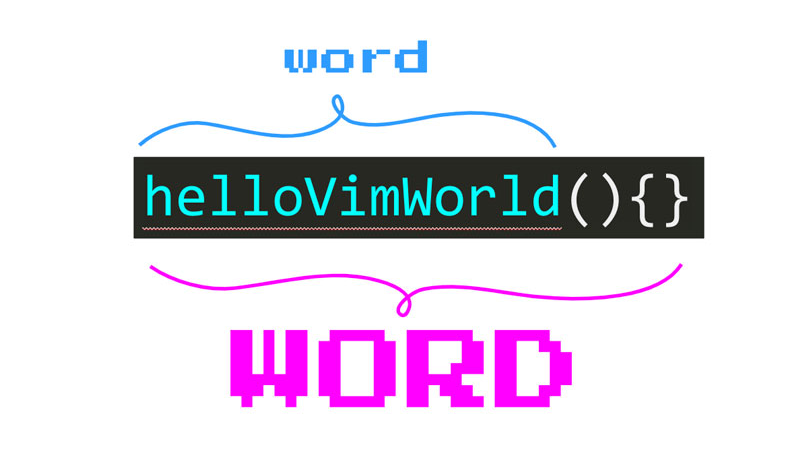

# Vim Motions

## Horizontal Movements

`w`: jump to beginning of next word
`b`: jump backwards to the beginning of a word
`e`: jump to end of word forwards
`ge`: jump to end of word backwards

`_`: moves to beginning of the line
`^`: moves to first non-blank character of a line
`0`: moves to first character of the line
`$`: moves to end of the line
`g_`: moves to non-blank character at the end of a line



`W`/`B`/`E`/`gE` - If you want to move WORD by WORD you can use the capitalized equivalents of the motions.

## Vertical Movements

`f{char}`: (find) to move to the next occurence of a character in the line. (e.g `f"` sends you to the next occurence of a double quote)
`F{char}`: find previous character
`t{char}`: (until) move the cursor just before the next occurrence of a character
`T{char}`: (until) move the cursor backwards just before the next occurrence of a character

```text
t(   ==> v                       v
         const fireball = function(target){
f(   ==> ^                        ^
```

`{`/`}`: jump entire paragraph downwards or upwards
`/{pattern}`/`?{pattern}`: forward search or backwards search (pattern can be string or regex)
`n`/`N`: navigate results forwards or backwards
`#`/`*`: searches backwards or forwards for the word under the cursor
`/<Enter>`/`?/<Enter>`: run the latest search (forward or backwards)
`zz`: centers search results for better visibility

## Advanced Motions

`{count}{command}`: multiply the effect of a command

```text
`2w` allows us to move the cursor 2 words forward.
`5j` changes your cursor position to 5 lines below.
`3;` lets you go to the next third occurrence of a character.
`2/baby` sends you flying to the second occurrence of baby in a document.)
```

`gd`: jump to definition of what is under cursor
`gf`: jump to a file in a import
`gg`: top of file
`{line}gg`: go to specific line
`G`: end of file
`%`: jump to matching `({[]})`

`ggVG` - select all
`vi(`/`va(`: quickly select content within or around braces, etc
`yi(`/`ya(`: yank inside () / yank inside () plus ()
`viw`: Selects the current word regardless of cursor position.
`viW`: Selects until whitespace, useful for complex types.
